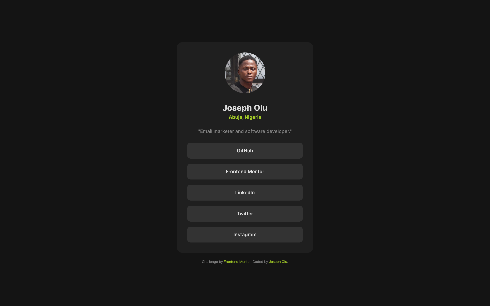

Design of a responsive social links profile with semantic HTML5 and CSS3. No frameworks or libraries were used.

This is a solution to the social links profile challenge on Frontend Mentor. Frontend Mentor challenges help you improve your coding skills by building realistic projects.

## Table of contents

- [Overview](#overview)
  - [The challenge](#the-challenge)
  - [Screenshot](#screenshot)
  - [Links](#links)
- [My process](#my-process)
  - [Built with](#built-with)
  - [What I learned](#what-i-learned)
- [Author](#author)

## Overview

### The challenge

Users should be able to:

- View the optimal layout depending on their device's screen size
- See hover and focus states for interactive elements

### Screenshot

- Desktop view

### Links

- Solution URL: [GitHub](https://github.com/JosephOluOlofinte/social-links-profile)
- Live Site URL: [Social Links Profile](https://josepholuolofinte.github.io/social-links-profile/)

## My process

### Built with

- Semantic HTML5 markup
- CSS3 custom properties
- Flexbox

### What I learned

Even though I've learned about CSS grid before now, I tried it out for the first time in this project. I am more of a flexbox guy, but I think grids are pretty cool too. 

I actually think Grid is better for certain layout situations where Flexbox may be a little bit problematic. For example, after playing around a bit with grid while building this project, I think I'd prefer display:grid to layout mobile view rather than display: flex; flex-direction: column.

## Author

- LinkedIn - [Joseph Olu Olofinte](https://www.linkedin.com/in/joseph-olu/)
- Frontend Mentor - [@JosephOluOlofinte](https://www.frontendmentor.io/profile/JosephOluOlofinte)
- Twitter - [@josepholofinte](https://www.twitter.com/josepholofinte)
